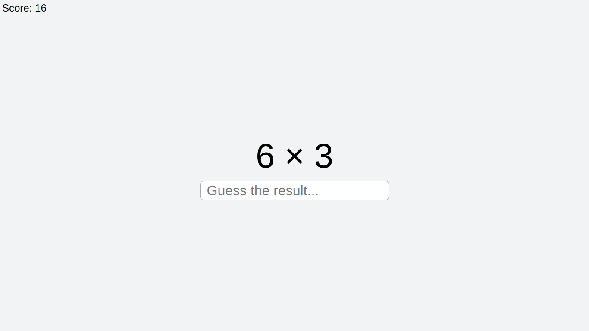

# Multiplier
Ever wonder if you know how to do times table? That's what the Multiplier is for! The easiest way to know is by doing the maths.

# How it works
Two numbers will be displayed on screen, that is a A and B number each one in a range of 1 to 9. Your mission is to answer the corresponding multiplication between A and B. For example, suppose you got a "7 * 8", your correct answer should be 56 to increase your Score by one, otherwise decreased. To win more points when a answer is correct you can strike a sequence of "x" numbers to get one more extra point. If you miss one, your sequence will be zeroed.
